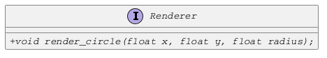
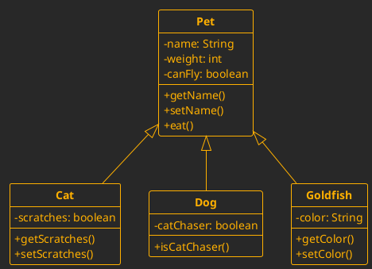

# How Bridge-Pattern works?

Suppose we have 2 classes of objects: 
- geometric shapes
- the renderers that can draww them on the screen

We assume that rendering can happen in vector or raster form, and in terms of shapes.

## Renderer interface

